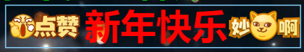

每条弹幕都能渲染文本以及图片内容，渲染效果如下所示：


# 涉及的 API
弹幕中渲染的图片需要配置到弹幕渲染器中，配置如下所示：
```ts
export type RendererOptions = {
  // 弹幕中渲染图片的配置
  barrageImages?: BarrageImage[];
}

export type BarrageImage = {
  // 弹幕图片的唯一标识
  id: string;
  // 图片的地址
  url: string;
  // 渲染时的宽
  width: number;
  // 渲染时的高
  height: number;
}
```
弹幕的 text 属性按照如下格式就能渲染出图片了，例如："[0001]新年快乐[0003]"。
```ts
export type BaseBarrageOptions = {
  // 弹幕的内容（eg：文本内容[图片id]文本内容[图片id]文本内容）
  text: string;
}
```