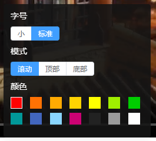

弹幕有三种类型，分别是：滚动弹幕、顶部底部弹幕和高级弹幕。
```ts
export type BarrageOptions = ScrollBarrageOptions | FixedBarrageOptions | SeniorBarrageOptions;
```

# 所有弹幕共有的配置项
```ts
export type BaseBarrageOptions = {
  // 弹幕的唯一标识
  id: string;
  // 弹幕的出现时间（毫秒为单位）
  time: number;
  // 弹幕的内容（eg：文本内容[图片id]文本内容[图片id]文本内容）
  text: string;
  // 弹幕的字体大小
  fontSize: number;
  // 弹幕的行高
  lineHeight: number;
  // 弹幕颜色
  color: string;
  // 是不是重要的
  prior?: boolean;
  // 自定义 render 相关配置
  customRender?: CustomRender;
  // 额外，附加的信息
  addition?: {
    [key: string]: any
  }
}

/**
 * 自定义 render 相关配置
 */
export type CustomRender = {
  // 弹幕的宽（弹幕实际的宽由具体的渲染操作决定，所以这里由用户自行传入）
  width: number;
  // 弹幕的高（弹幕实际的高由具体的渲染操作决定，所以这里由用户自行传入）
  height: number;
  // 弹幕自定义渲染函数
  renderFn: RenderFn;
}

/**
 * 自定义 render 函数
 */
export type RenderFn = (options: CustomRenderOptions) => void;

/**
 * 自定义 render 函数的参数
 */
export type CustomRenderOptions = {
  // 渲染上下文
  ctx: CanvasRenderingContext2D | OffscreenCanvasRenderingContext2D;
  // 渲染的弹幕实例
  barrage: BaseBarrage;
  // 渲染器实例
  br: BarrageRenderer;
  // 缓存获取图片的工厂方法
  imageElementFactory: (url: string) => HTMLImageElement,
}
```

# 滚动弹幕
```ts
export type ScrollBarrageOptions = BaseBarrageOptions & {
  // 弹幕的类型
  barrageType: 'scroll';
}
```
::: warning 注意
出于性能以及实际渲染效果的考虑，请不要将滚动弹幕的 fontSize 设置的差距过大，最好将滚动弹幕的 fontSize 设置成固定的几个值。

例如我完整 DEMO 中的设计，滚动弹幕的 fontSize 固定只有两种，分别是：小：24px；标准：34px；

:::

# 顶部底部弹幕
```ts
export type FixedBarrageOptions = BaseBarrageOptions & {
  // 弹幕的类型
  barrageType: 'top' | 'bottom';
  // 固定弹幕能够存在的时间
  duration: number;
}
```

# 高级弹幕
```ts
export type SeniorBarrageOptions = BaseBarrageOptions & {
  // 弹幕的类型
  barrageType: 'senior';
  // 高级弹幕配置
  seniorBarrageConfig: SeniorBarrageConfig;
}

/**
 * 用于描述高级弹幕的运动配置
 */
export type SeniorBarrageConfig = {
  // 起始点
  startLocation: LocationDefine;
  // 结束点
  endLocation: LocationDefine;
  // 生存时间（单位为毫秒）（数据要求：> 0）
  totalDuration: number;
  // 延迟时间（单位为毫秒）（数据要求：>= 0）
  delay: number;
  // 运动时长（单位为毫秒）（数据要求：>= 0）
  motionDuration: number;
}

/**
 * 用于描述二位平面中的一点（面向用户）
 */
export type LocationDefine = Location & {
  // 定义的类型：直接像素 或 canvas 百分比
  type?: 'PIXEL' | 'PERCENT';
  // 在 x、y 定义的基础上进行坐标偏移
  offsetX?: number;
  offsetY?: number;
}

/**
 * 用于描述二位平面中的一点（单位 px）
 */
export type Location = {
  x: number;
  y: number;
}
```
