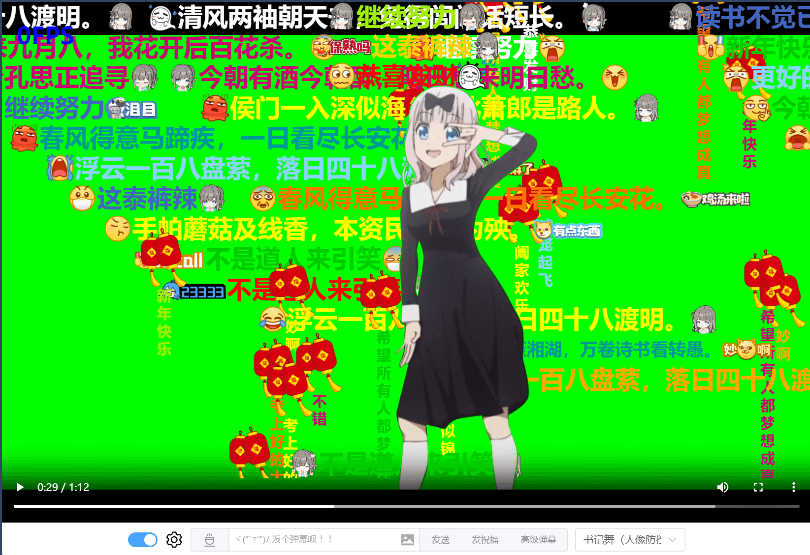

# 蒙版（实现人像免遮挡）
相关 API 如下所示：
```ts
declare class BarrageRenderer {
  /**
   * 设置蒙版数据
   * @param mask 图片的 url 或者 ImageData 数据
   */
  setMask(mask?: string | ImageData): void;
}
```
一旦设置了蒙版数据，弹幕库内部便会先进行蒙版数据的绘制，将渲染上下文的 globalCompositeOperation 属性设置成 'source-out'，最后绘制弹幕层的内容，如果蒙版数据对应人像轮廓的话，就可以实现人像免遮挡的效果了。

这是完整 DEMO 中实现的效果，没有借助后端，纯前端实现人像蒙版数据的计算，最终实现人像免遮挡的效果。
